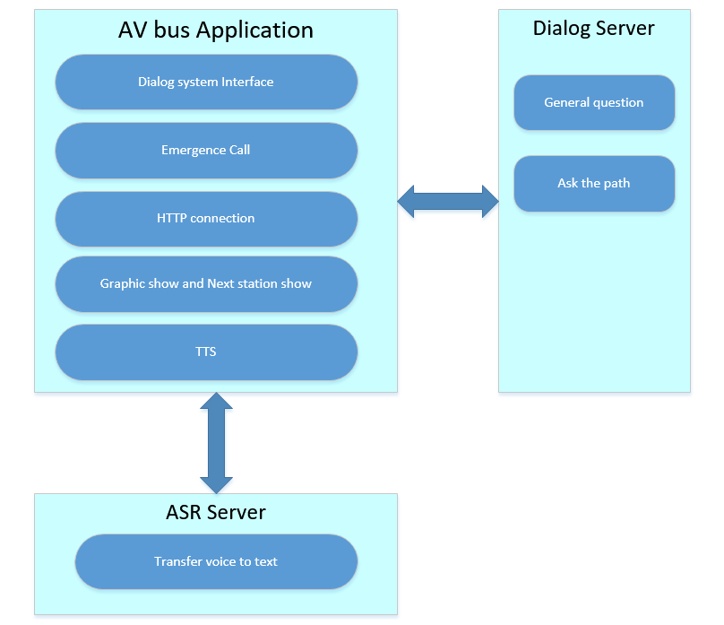

## Description
This project is android UI for dialogue system

## Still pending issues
- QR code focus
- scrolling message (solved now- in optimized UI)

## The framework of this system


## How to create wakeup words system
1. train your wakeup words recognize model by tensorflow

TODO ADD BY Maulik

2. add plugin `tflite` at the file `build.gradle` of project

   ```
   aaptOptions {
       noCompress "tflite"
       noCompress "lite"
   }
   implementation 'org.tensorflow:tensorflow-lite:0.0.0-nightly'
   ```

3. load the recognize model which trained by tensorflow to project

   ```
   private static final String LABEL_FILENAME = "file:///android_asset/conv_labels.txt";
   private static final String MODEL_FILENAME = "file:///android_asset/retrained_graph.tflite";

           String actualLabelFilename = LABEL_FILENAME.split("file:///android_asset/", -1)[1];
           Log.i(LOG_TAG, "Reading labels from: " + actualLabelFilename);
           BufferedReader br = null;
           try {
               br = new BufferedReader(new InputStreamReader(getAssets().open(actualLabelFilename)));
               String line;
               while ((line = br.readLine()) != null) {
                   Log.d(LOG_TAG, line);
                   labels.add(line);
                   if (line.charAt(0) != '_') {
                       displayedLabels.add(line.substring(0, 1).toUpperCase() + line.substring(1));
                   }
               }
               br.close();
           } catch (IOException e) {
               throw new RuntimeException("Problem reading label file!", e);
           }

           // Set up an object to smooth recognition results to increase accuracy.
           recognizeCommands =
                   new RecognizeCommands(
                           labels,
                           AVERAGE_WINDOW_DURATION_MS,
                           DETECTION_THRESHOLD,
                           SUPPRESSION_MS,
                           MINIMUM_COUNT,
                           MINIMUM_TIME_BETWEEN_SAMPLES_MS);

           String actualModelFilename = MODEL_FILENAME.split("file:///android_asset/", -1)[1];
           Log.d(LOG_TAG, actualModelFilename);
           try {
               tfLite = new Interpreter(loadModelFile(this.getAssets(), actualModelFilename));
           } catch (Exception e) {
               throw new RuntimeException(e);
           }

           tfLite.resizeInput(0, new int[]{RECORDING_LENGTH, 1});
           tfLite.resizeInput(1, new int[]{1});
   ```

4. start to listen wakeup words
User can use the function `startRecording` and `startRecognition` to start listen wakeup words. You can check the detail at the file of `SpeechActivity.java`.


## How to create customize ASR
This is a guide of using customize ASR (created by NUS NTU and AI.SG)

1. create a customize ASR module
User should create a class extend from RecognitionService. you can check the detail on the file of `AbstractRecognitionService.java`.
At this class, you should make sure to implement those function: `onStartListening`, `onStopListening`

2. create socket connection to ASR server
User should create a connection ASR server, we create a socket connection to ASR server. you can check the detail of the file `WebSocketRecognitionService.java`.
At this class, you need to finish those function: `connect`, `disconnect`, `startSocket`, `startSending`, `send`

3. change the ASR manager, replace the default ASR to customize ASR
In this manager, user can use those code to call customize ASR. you can check the detail of `SpeechRecognizerManager.java`

   ```
   private AudioManager mAudioManager;
   private SpeechRecognizer mSpeechRecognizer;
   private Intent mSpeechRecognizerIntent;

   mAudioManager = (AudioManager) context.getSystemService(Context.AUDIO_SERVICE);
   mSpeechRecognizer = SpeechRecognizer.createSpeechRecognizer(context);
   mSpeechRecognizer.setRecognitionListener(new SpeechRecognitionListener());
   mSpeechRecognizerIntent = new Intent(RecognizerIntent.ACTION_RECOGNIZE_SPEECH);  // you need create a default ASR recognize module before using it.
   mSpeechRecognizerIntent.putExtra(RecognizerIntent.EXTRA_LANGUAGE_MODEL,
           RecognizerIntent.LANGUAGE_MODEL_FREE_FORM);
   mSpeechRecognizerIntent.putExtra(RecognizerIntent.EXTRA_CALLING_PACKAGE,
           context.getPackageName());
   ```

4. Using customize ASR at our project
User can use the customize ASR created above.

   ```
   new SpeechRecognizerManager(this, new SpeechRecognizerManager.onResultsReady() {
               @Override
               public void onResults(ArrayList<String> results) {
                    // todo create yourself code
               }
           });
   ```

## How to add Emergence button at system
on this system we create 'Emergence button' by calling the service of android call
1. add permission

    ```
    <uses-permission android:name="android.permission.MANAGE_OWN_CALLS" />
    <uses-permission android:name="android.permission.READ_CALL_LOG" />
    <uses-permission android:name="android.permission.READ_PHONE_STATE" />
    <uses-permission android:name="android.permission.CALL_PHONE" />
    ```

2. call the action of 'ACTION_CALL' to call emergence call

    ```
    private void intentToCall(String phoneNumber) {
        Intent intent = new Intent(Intent.ACTION_CALL);
        Uri data = Uri.parse("tel:" + phoneNumber);
        intent.setData(data);
        if (ActivityCompat.checkSelfPermission(this, Manifest.permission.CALL_PHONE) != PackageManager.PERMISSION_GRANTED) {
            // TODO: Consider calling
            return;
        }
        startActivity(intent);
    }
    ```

## How to connect with engine(server)

the android client is connect with engine by the library of `retrofit2`:
1. import the library of `retrofit2`

    ```
    implementation 'com.squareup.retrofit2:retrofit:2.4.0'
    implementation 'com.squareup.retrofit2:converter-gson:2.4.0'
    ```

2.  Add permission

    ```
    <uses-permission android:name="android.permission.INTERNET" />
    ```

3. create http connection interface

    ```
    public interface HttpUtil
    {
        @GET("massage_str/{bus_id}")
        Call<TextMessage> getTextMessage(@Path(value = "bus_id", encoded = true) String bus, @Query("request_str_data") String input);
    }
    ```

4. using http connection at application (in real project, it better to using 'ExecutorService' to create Thread Pool to exec http connection)

   ```
   httpUtil = RetrofitClientInstance.getRetrofitInstance(path).create(HttpUtil.class);
   textInfo = httpUtil.getTextMessage(bus_id, input);
   ```


## Important files
File/dir|Location | details
---|---|---
D  | ./app/src/main/java/xyz/hiroshifuu/speechapp| java source files
D  | ./app/src/main/java/xyz/hiroshifuu/speechapp/activity| source files of activity
D  | ./app/src/main/java/xyz/hiroshifuu/speechapp/commons| source files include styles and http connection
D  | ./app/src/main/java/xyz/hiroshifuu/speechapp/messages| source files include format of Message list and message input
D  | ./app/src/main/res | layout and design files
D  | ./app/src/main/res/drawable | icons/symbols in layout
D  | ./app/src/main/res/layout | layout files
D  | ./app/src/main/java/xyz/hiroshifuu/speechapp/activity | All files related to different ui (speech and main-QR code)
F  | ./app/src/main/AndroidManifest.xml | permission and connections of all modules
F  | ./app/src/main/java/xyz/hiroshifuu/speechapp/activity/MainActivity.java | Opening interface (QR code)
F  | ./app/src/main/java/xyz/hiroshifuu/speechapp/activity/SpeechActivity.java | main UI file (Please change SERVER and PORT as per your requirement)
F  | ./app/src/main/java/xyz/hiroshifuu/speechapp/commons/ProperUtil.java | source code for client to send and recive data
F  | ./app/src/main/java/xyz/hiroshifuu/speechapp/adapter/MessageListAdapter| control the list view of message
F  | ./app/src/main/java/xyz/hiroshifuu/speechapp/adapter/MessageHolder| control the layout of message
F  | ./app/src/main/res/layout/active_chat_dialog.xml | layout of speech activity
F  | ./app/src/main/res/layout/item_incoming_text_message.xml | layout of request message
F  | ./app/src/main/res/layout/item_outcoming_text_message.xml | layout of response message
